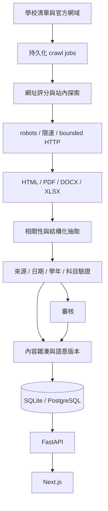

# 架構

`frontend/` 負責使用者互動。`backend/` 擁有資料契約、持久化與審核。`crawler/` 執行抓取與解析，使用後端資料層儲存結果。SQLite 適合單機開發；多服務部署使用 PostgreSQL。Redis 與物件儲存留待實際佇列／檔案容量需要時接入，MVP 不假裝已具備。

公開 API 只顯示允許發布的版本；管理員 API 用 Bearer token 保護。正式環境應放在 TLS、反向代理與私有管理網路後，並改用個別帳號與權限。

學校 registry 不等於已驗證段考資料。示範資料只供展示，不作 recall、accuracy 或已收錄量的正式統計。生產設定預設不啟用 seed。

模型抽取只能消費已下載且經解析的公開內容。模型供應商應獨立接入並進行成本、schema、版本與信心校準；本版不需要 API key，也不會發送文件到外部模型。
